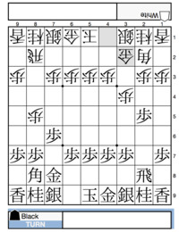

=============
Customization
=============

In the **Settings** menu, there are several options for customizing the look and feel of the shogi board.

.. note::
   The settings will be saved for your browser, specifically in Local Storage. That is, you will need to set options for each device/browser, and settings will be reset when you clear Local Storage on your browser.

   Settings menu

Board size
==========

By default, the board size is automatically adjusted to your screen. You may optionally fix the board size, from ``15 - Extra Small`` to ``60 - Extra Large``. Here the number (15, ..., 60) represents the width in pixels of each square on board.

   Extra Small

   Extra Large

Layout
======

You can choose one of the board layouts as you prefer.

   Standard

   Compact

   Wide

Piece graphic
=============

You can change piece graphic. New graphics might be added upon your request.

   Japanese 5

   Western 1

   Hidetchi

Board background
================

You can choose the color of the board background. The colors of the cursor and last move will also change.

   Default

   Natural

Coordinates
===========

You can choose the style of the rank-wise coordinate.

   Japanese

   Alphabet

   Numbers

Double Board mode
=================

If you enable the Double Board mode, two shogi boards are shown in the main pane. The right one is flipped so you can see White's view. On a mobile screen, this feature is available only when the screen orientation is **landscape**.

   Double Board (PC)

   Double Board (mobile)

Visual effects
==============

You can disable or enable visual effects. Examples of visual effects are:

- flash of movable positions when you choose a piece
- promotion animation

This feature is **on** by default but will be disabled on some browsers such as Internet Explorer.

Sound effects
=============

You can disable or enable sound effects. Examples of sound effects are:

- selection of a piece
- movement of a piece
- flipping the board

This feature is **off** by default in order not to surprise you.

Language settings
=================

Shogi Playground sets your default language to the first language setting on your browser --usually the same as the OS language, but you may override it on your preference.

Messages
--------

You can change the language for the entire system. This also affects the default player names.

   Messages: English

   Messages: Japanese

Record
------

You can change the language for shogi record.

   Record: English

   Record: Japanese

Configuration by query parameters
=================================

*For advanced users*

You may apply customization via URL query parameters.

.. note:: A query parameter is a key-value pair following the base URL. If you specify two query parameters, the whole URL will be like this:

   ``https://play.mogproject.com/?<key1>=<value1>&<key2>=<value2>``

   Please consult to `the developer document <https://github.com/mogproject/mog-playground/wiki/Query-Parameters>`_ for the complete list of the supported query parameters.

Other color sets
----------------

You can use the following keys for specifying colors.

- ``colorbg``: board background
- ``colorcs``: cursor
- ``colorlm``: last move

The values must be in the hex format for colors.

Example:

Here is a URL of setting green, red, blue for background, cursor, last move, respectively.

``https://play.mogproject.com/?colorbg=00ff00&colorcs=ff0000&colorlm=0000ff``

Other board sizes
-----------------

You may specify the board size with the query key ``sz``. The value must be a positive integer which you wish to set to the width in pixels of a square on board.

Example:

If you have a large screen, you will be able to display a board larger than Extra Large.

``https://play.mogproject.com/?sz=80``

